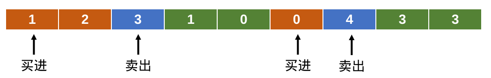
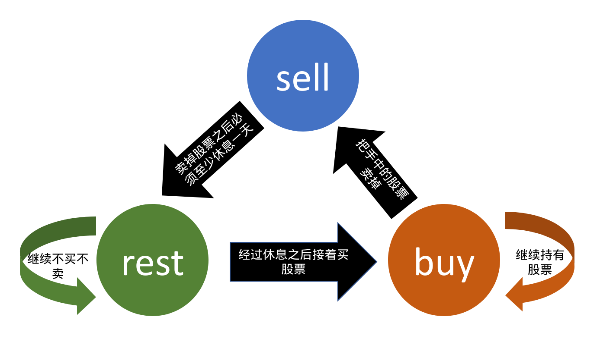

# E题题解

## 解题思路

这道题实际上就是带冷冻期的股票最大收益问题。  

### 状态

首先本题肯定是一道dp了。在本题中，我们很容易猜到子问题应该是第i天的收益情况；进一步，我们发现每个第i天有三种可能的状态：已经买进股票并持有（状态buy）（不仅包括）、卖出股票（状态sell）、手中没有股票且不进行买卖活动（状态rest）。因此，我们的任务就变成了递推的求出截止到每一天，在每种可能的状态下的收益情况。下面的工作就是求解状态转移方程了。
  
下面是在股票价格变化为`1 2 3 1 0 0 4 3 3`时状态示意图。其中橙色表示处于状态buy，蓝色表示处于状态sell，绿色表示处于状态rest。  



### 状态转移

下面的示意图说明了某一天的三个状态与前一天的三种状态之间的转移关系。



这样，我们就很容易写出核心部分代码：

```c++
rest[i] = max(rest[i-1], sell[i-1]);
buy[i] = max(rest[i-1]-prices[i], buy[i-1]);
sell[i] = buy[i-1] + prices[i];
```

### 初始化

我们考虑了第一天的情况，我们假设初始时金额为0元，那么，在第一天，如果处于sell状态，收益为`0`元，因为没什么可卖的；如果处于rest状态，那么收益显然还是`0`元；如果处于buy状态，显然要花钱才能买，所以应该初始化为`0-prices[0]`元。

```c++
rest[0] = 0;
buy[0] = 0 - prices[0];
sell[0] = 0;
```

### 注意事项

用`int`会wa的，数据大小应该开到`long long`。
